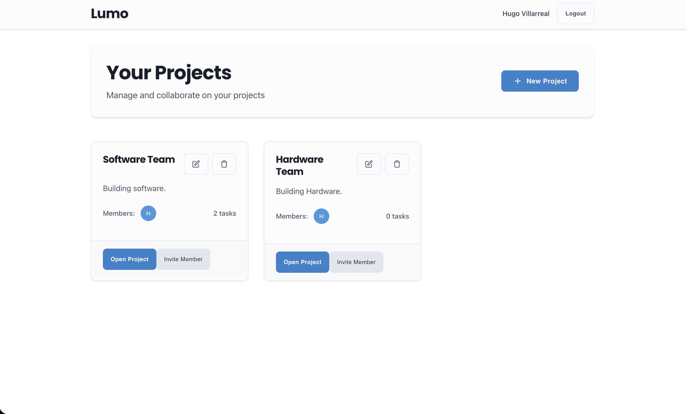
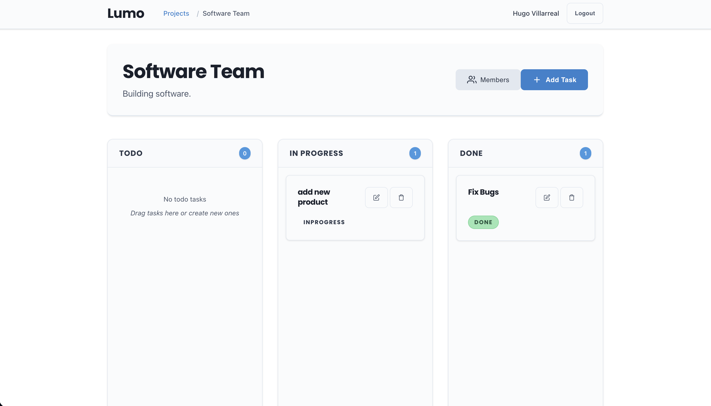

# Lumo

A modern, full-stack project management web application built with ASP.NET Core Web API and Vue 3. Features include project and task management, team collaboration, drag-and-drop Kanban boards, and dark mode support.



## 🏗️ Architecture

- **Backend**: ASP.NET Core 8 Web API with Entity Framework Core
- **Frontend**: Vue 3 + TypeScript + Vite + Pinia + Vue Router
- **UI Framework**: Tailwind CSS with dark mode support
- **Database**: PostgreSQL
- **Authentication**: JWT (JSON Web Tokens)
- **Deployment**: Docker containerized

## ✨ Features

### Core Features

- **User Authentication**: Register and login with JWT-based auth
- **Project Management**: Create, edit, and delete projects
- **Task Management**: Full CRUD operations with drag-and-drop Kanban boards
- **Team Collaboration**: Invite members and manage project roles
- **Dark Mode**: Toggle between light and dark themes
- **Responsive Design**: Works seamlessly on desktop and mobile

### Kanban Board

- **Three Columns**: Todo, In Progress, Done
- **Drag & Drop**: Move tasks between columns and reorder within columns
- **Real-time Updates**: Changes sync automatically
- **Task Details**: Due dates, assignees, descriptions

## 📸 Screenshots

### Dashboard Overview


### Kanban Board in Action



## 🚀 Quick Start

### Prerequisites

- Docker and Docker Compose
- Git

### Development Setup

#### 🚀 Quick Start (Hot Reloading)

1. **Clone the repository**

   ```bash
   git clone <repository-url>
   cd Lumo
   ```

2. **Start with hot reloading (Recommended)**

   ```bash
   docker-compose -f docker-compose.dev.yml up --build
   ```

3. **Access the application**

   - Frontend: http://localhost:5173 (Vite dev server with HMR)
   - Backend API: http://localhost:5001 (ASP.NET with dotnet watch)
   - API Documentation: http://localhost:5001/swagger

4. **Database Setup**
   The PostgreSQL database will be automatically created and seeded with initial data.

   **Important**: If this is your first run after our security update, you'll need to update the database password in PostgreSQL itself. See the security instructions in the project documentation.

#### 🛠️ Development Features

**Hot Reloading Setup** (`docker-compose.dev.yml`):

- **Frontend Hot Reload**: Vue.js components, CSS, and JS files auto-reload instantly
- **Backend Hot Reload**: C# files trigger automatic rebuilds with `dotnet watch`
- **Volume Mounting**: Source code mounted directly for instant updates
- **Development Servers**: Uses optimized dev servers instead of production builds

#### 🏗️ Production Setup

For production deployment, use the standard setup:

```bash
docker-compose up --build
```

This uses:

- **Multi-stage builds** for optimized images
- **Nginx for frontend** (static asset serving)
- **ASP.NET runtime** for backend (smaller than SDK)

#### 🏭 Production Deployment

For production deployment, use the optimized production setup:

1. **Configure environment variables**

   Edit the `.env` file in the root directory with your production values:

   ```bash
   # Edit .env with your production database and JWT settings
   nano .env
   ```

2. **Deploy with production configuration**
   ```bash
   docker-compose -f docker-compose.prod.yml up --build -d
   ```

The production setup includes:

- **Multi-stage builds** for smaller, optimized images
- **Environment variable configuration**
- **Separate production Dockerfiles** (`Dockerfile.prod`)
- **Nginx for frontend** serving static assets
- **ASP.NET runtime image** for backend (smaller than SDK)

### Manual Setup (without Docker)

#### Backend Setup

1. **Navigate to server directory**

   ```bash
   cd server
   ```

2. **Install dependencies**

   ```bash
   dotnet restore
   ```

3. **Set up database**

   ```bash
   # Update connection string in appsettings.json with your database details
   dotnet ef database update
   ```

4. **Run the backend**
   ```bash
   dotnet run
   ```

#### Frontend Setup

1. **Navigate to client directory**

   ```bash
   cd client
   ```

2. **Install dependencies**

   ```bash
   npm install
   ```

3. **Start development server**
   ```bash
   npm run dev
   ```

## 📁 Project Structure

```
Lumo/
├── server/                 # ASP.NET Core Web API
│   ├── Controllers/        # API controllers
│   ├── Models/            # Entity models
│   ├── DTOs/              # Data transfer objects
│   ├── Services/          # Business logic services
│   ├── Data/              # Database context
│   └── Program.cs         # Application startup
├── client/                 # Vue 3 frontend
│   ├── src/
│   │   ├── components/     # Reusable Vue components
│   │   ├── pages/         # Page components
│   │   ├── store/         # Pinia stores
│   │   ├── api/           # API client functions
│   │   ├── types/         # TypeScript type definitions
│   │   └── styles/        # CSS styles
│   ├── Dockerfile         # Production build
│   ├── Dockerfile.dev     # Development with hot reload
│   ├── package.json       # Dependencies
│   └── vite.config.ts     # Vite configuration
├── docker-compose.yml     # Production Docker orchestration
├── docker-compose.dev.yml # Development with hot reload
└── README.md              # This file
```

## 🔧 Configuration

### Environment Variables

The application uses environment variables for secure configuration. Create a `.env` file in the root directory:

```bash
# Database Configuration
POSTGRES_USER=postgres
POSTGRES_PASSWORD=your-secure-password-here
POSTGRES_DB=lumo

# JWT Configuration
JWT_KEY=your-secure-jwt-key-here
```

#### Backend Configuration

The backend reads configuration from environment variables set in `docker-compose.yml`. The connection string and JWT settings are automatically populated from your `.env` file.

**⚠️ Security Note**: Never commit your `.env` file to version control. It's already included in `.gitignore`.

### API Endpoints

#### Authentication

- `POST /api/auth/register` - User registration
- `POST /api/auth/login` - User login

#### Projects

- `GET /api/projects` - Get user's projects
- `POST /api/projects` - Create new project
- `GET /api/projects/{id}` - Get project details
- `PUT /api/projects/{id}` - Update project
- `DELETE /api/projects/{id}` - Delete project
- `POST /api/projects/{id}/invite` - Invite member
- `GET /api/projects/{id}/members` - Get project members

#### Tasks

- `GET /api/projects/{projectId}/tasks` - Get project tasks
- `POST /api/projects/{projectId}/tasks` - Create task
- `PUT /api/tasks/{id}` - Update task
- `DELETE /api/tasks/{id}` - Delete task
- `PUT /api/tasks/update-statuses` - Batch update task statuses

## 🎨 UI/UX Features

### Dark Mode

- Toggle between light and dark themes
- Persistent user preference
- Tailwind CSS dark mode classes

### Responsive Design

- Mobile-first approach
- Adaptive layouts for all screen sizes
- Touch-friendly interactions

### Drag & Drop

- Intuitive task management
- Visual feedback during drag operations
- Optimistic updates for smooth UX

## 🧪 Development

### Running Tests

```bash
# Backend tests
cd server
dotnet test

# Frontend tests (if added)
cd client
npm run test
```

### Code Quality

- TypeScript for type safety
- ESLint for code linting
- Prettier for code formatting

## 🚢 Deployment

### Production Docker

1. Ensure your `.env` file contains the correct production values
2. Build and deploy:
   ```bash
   docker-compose -f docker-compose.yml up --build -d
   ```

**Note**: The `docker-compose.yml` file now reads all secrets from environment variables, so no manual updates are needed.

### Manual Deployment

1. Build frontend: `npm run build`
2. Publish backend: `dotnet publish -c Release`
3. Deploy to your hosting platform

## 🤝 Contributing

1. Fork the repository
2. Create a feature branch: `git checkout -b feature/amazing-feature`
3. Commit your changes: `git commit -m 'Add amazing feature'`
4. Push to the branch: `git push origin feature/amazing-feature`
5. Open a Pull Request

## 📝 License

This project is licensed under the MIT License - see the LICENSE file for details.

## 🙏 Acknowledgments

- [Vue.js](https://vuejs.org/) - Progressive JavaScript framework
- [ASP.NET Core](https://docs.microsoft.com/en-us/aspnet/core/) - Cross-platform web framework
- [Tailwind CSS](https://tailwindcss.com/) - Utility-first CSS framework
- [SortableJS](https://sortablejs.github.io/) - Drag and drop library
- [Font Awesome](https://fontawesome.com/) - Icon library

## 📞 Support

For support, email [your-email@example.com] or create an issue in the repository.

---

Made with ❤️ for modern project management
